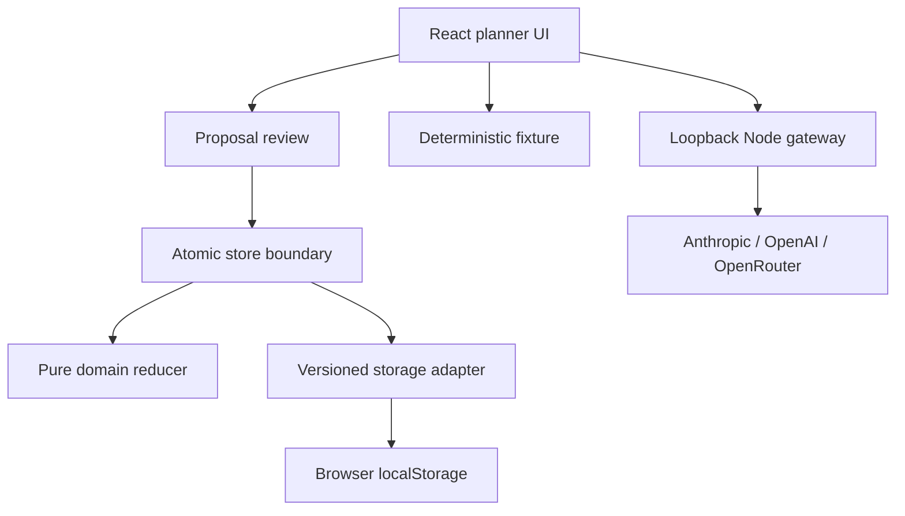

# 7DayFocus AI Delivery Lab

A local-first weekly planner with a human-approved AI assistant: bring an Anthropic, OpenAI, or OpenRouter key, review a bounded proposal, and explicitly approve every change.

[Built by Andreas Nissen](https://github.com/Andreasniss) · [Source repository](https://github.com/Andreasniss/7dayfocus-ai-delivery-lab) · Apache-2.0

> **Portfolio status:** P02 domain and persistence hardening is merged and owner-accepted. P04 adds the provider-flexible Plan My Week workflow under a separate lifecycle, threat model, eval suite, and human-approval boundary. This is an independent reference project, not a production service or a claim of provider affiliation, adoption, reliability, or scale.

## See the proof in 60 seconds

```bash
nvm use
npm ci
npm run verify
npm run dev
```

Open the Vite URL, add two fictional tasks to one day, open **Plan my week**, keep **Fixture demo**, and generate a proposal. Review the complete diff and select **Approve all changes**. Expected result: no task changes during generation; one validated move or priority change is applied only after approval.

Fixture mode needs no provider account or API key and makes no external request. Live mode requires the local gateway started by `npm run dev`, a user-owned provider key, and non-sensitive fictional planner data.

## What this demonstrates

| Capability | Inspectable evidence |
| --- | --- |
| Hands-on TypeScript/React engineering | Local planner UI, state boundary, import/export, and browser persistence |
| Domain correctness | Pure deterministic reducer with task, week, capacity, priority, move, and rollover invariants |
| Reliability and recovery | Versioned storage, bounded P01 migration, strict portable v2, non-destructive corrupt-data handling |
| Evaluation discipline | 235 automated tests across success, boundary, malformed-input, recovery, capacity, accessibility, provider-adapter, and proposal-evaluation behavior |
| Applied model integration | Anthropic Messages, OpenAI Responses, and OpenRouter Chat Completions behind one proposal contract |
| Human control | Structured proposal, independent invariant validation, complete diff, stale-state check, explicit approval, atomic application |
| AI-assisted delivery | Accepted intent/specification/plan, ADRs, evidence ledger, severity-based review, and retained findings |
| Security judgment | Ephemeral BYOK handling, loopback gateway, fixed provider destinations, synthetic-data rule, and explicit residual limits |

## Architecture



UUID and date creation occur outside the reducer. Stored, imported, and model-generated JSON is treated as untrusted input. Invalid or stale proposals are rejected atomically. Fixture mode makes no provider request; live mode sends one bounded request through a loopback-only gateway to the selected fixed provider origin.

## Guided reviewer path

1. Read [`docs/ai-dlc/README.md`](docs/ai-dlc/README.md) for the lifecycle and source boundary.
2. Open the [`P04 intent, specification, plan, and evidence`](docs/ai-dlc/changes/P04-plan-my-week/) for the accepted applied-AI contract.
3. Inspect [`src/domain/planProposal.ts`](src/domain/planProposal.ts), [`server/providers.mjs`](server/providers.mjs), and the [24 deterministic eval cases](evals/README.md).
4. Read [`ADR 0004`](docs/adr/0004-local-byok-proposal-gateway.md) and the [`threat model`](docs/THREAT-MODEL.md).
5. Inspect [`docs/ai-dlc/changes/P02-domain-hardening/`](docs/ai-dlc/changes/P02-domain-hardening/) and [`ADR 0002`](docs/adr/0002-domain-and-persistence-invariants.md) for the underlying planner invariants.
6. Review [`SECURITY.md`](SECURITY.md), [`PROVENANCE.md`](PROVENANCE.md), and [`REVIEW.md`](REVIEW.md) for limits, ownership, and review gates.

## Current product boundary

The planner supports creating, editing, completing, prioritizing, labeling, moving, deleting, reviewing, carrying over, importing, and exporting tasks. State is stored as plaintext JSON in the current browser profile.

The project deliberately excludes:

- model-driven task creation, rewriting, deletion, completion, automatic application, or background execution;
- authentication, accounts, multi-user operation, hosted credential storage, or a remotely accessible gateway;
- telemetry, analytics, cloud application deployment, or production persistence;
- customer, employer, health, financial, or other sensitive data; and
- claims of production readiness, security certification, accessibility conformance, adoption, reliability, or scale.

Use only non-sensitive synthetic or fictional planner data. Live requests are subject to the selected provider's policies and billing. Concurrent tabs remain last-write-wins. Live-provider behavior, rendered visual QA, and hosted CI are claimed only when their results are explicitly recorded in current evidence.

## Bring your own provider key

| Provider | Default model | API shape | Credential behavior |
| --- | --- | --- | --- |
| Anthropic | `claude-sonnet-5` | Messages API with native structured outputs | Cleared from the UI after the request |
| OpenAI | `gpt-5.6-luna` | Responses API with `store: false` and structured outputs | Cleared from the UI after the request |
| OpenRouter | `openrouter/free` | Chat Completions with structured outputs and required-parameter routing | Cleared from the UI after the request |

Model IDs are editable because availability changes. The provider cannot change the endpoint: the gateway maps the selected provider to one fixed HTTPS origin. API keys are not stored, exported, logged, or committed. Browser extensions and local-machine compromise remain outside this reference project's protection boundary.

## AI-assisted delivery disclosure

Andreas owns product intent, architecture, requirements, evaluation criteria, risk acceptance, and release decisions, and reviews merged work. Claude Code assisted the predecessor project. OpenAI Codex assisted the clean-room extraction, P02 and P04 implementation, tests, documentation, and verification. AI output is treated as proposed work, not as independent human review or evidence of correctness.

The lifecycle is derived from selected public Anthropic material and adapted with provider-neutral project conventions. It is not an Anthropic standard, certification, approval, endorsement, or compliance claim. No raw prompts, private reasoning, customer material, or employer-confidential data are included.

## License and independence

Code and documentation are licensed under the [Apache License 2.0](LICENSE), subject to third-party package licenses in `package-lock.json`.

This independent project is not affiliated with, sponsored by, or endorsed by Anthropic, OpenAI, AWS, or any other provider or employer. Third-party names and marks belong to their respective owners.
