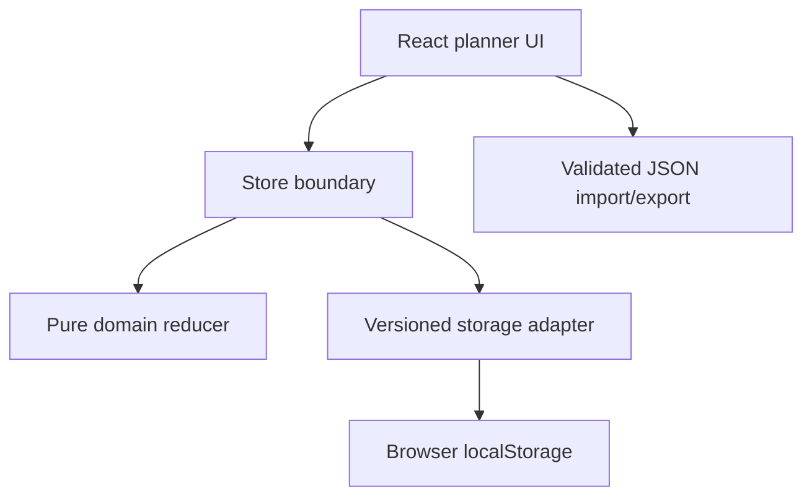

# 7DayFocus AI Delivery Lab

A local-first React weekly planner used to demonstrate inspectable AI-assisted software delivery: explicit intent, architecture decisions, adversarial tests, review findings, and honest evidence limits.

[Built by Andreas Nissen](https://github.com/Andreasniss) · [Source repository](https://github.com/Andreasniss/7dayfocus-ai-delivery-lab) · Apache-2.0

> **Portfolio status:** P02 domain and persistence hardening is merged and owner-accepted. This is an independent reference project, not a production service or a claim of provider affiliation, adoption, reliability, or scale.

## See the proof in 60 seconds

```bash
nvm use
npm ci
npm run verify
npm run dev
```

Open the Vite URL, add a fictional task, mark it as a priority, move it to another day, export the week, and import it again. Expected result: the task survives browser-local persistence; moves reset completion and priority state; malformed imports are rejected without replacing the current plan.

No provider account, API key, backend, database, telemetry, or remote application service is required.

## What this demonstrates

| Capability | Inspectable evidence |
| --- | --- |
| Hands-on TypeScript/React engineering | Local planner UI, state boundary, import/export, and browser persistence |
| Domain correctness | Pure deterministic reducer with task, week, capacity, priority, move, and rollover invariants |
| Reliability and recovery | Versioned storage, bounded P01 migration, strict portable v2, non-destructive corrupt-data handling |
| Evaluation discipline | 172 automated tests across success, boundary, malformed-input, recovery, capacity, and accessibility behavior |
| AI-assisted delivery | Accepted intent/specification/plan, ADRs, evidence ledger, severity-based review, and retained findings |
| Security judgment | Local-only trust boundary, synthetic-data rule, explicit plaintext-storage and last-write-wins limitations |

## Architecture



UUID and date creation occur outside the reducer. Stored and imported JSON is treated as untrusted input. Invalid domain actions are rejected atomically. The application starts empty and makes no runtime network request to an application or model-provider service.

## Guided reviewer path

1. Read [`docs/ai-dlc/README.md`](docs/ai-dlc/README.md) for the lifecycle and source boundary.
2. Open the [`P03 release-readiness evidence`](docs/ai-dlc/changes/P03-public-release-readiness/evidence.md) for the current 172-test gate, hosted-CI result, visual-QA blocker, and review history.
3. Inspect [`docs/ai-dlc/changes/P02-domain-hardening/`](docs/ai-dlc/changes/P02-domain-hardening/) for the accepted engineering change packet and evidence.
4. Read [`docs/adr/0002-domain-and-persistence-invariants.md`](docs/adr/0002-domain-and-persistence-invariants.md) for the core engineering decisions.
5. Inspect [`src/domain/weekState.ts`](src/domain/weekState.ts) and its adversarial tests in [`src/test/domainWeekState.test.ts`](src/test/domainWeekState.test.ts).
6. Review [`SECURITY.md`](SECURITY.md), [`PROVENANCE.md`](PROVENANCE.md), and [`REVIEW.md`](REVIEW.md) for the limits, ownership, and review contract.

## Current product boundary

The planner supports creating, editing, completing, prioritizing, labeling, moving, deleting, reviewing, carrying over, importing, and exporting tasks. State is stored as plaintext JSON in the current browser profile.

The project deliberately excludes:

- model-provider integration or prompt orchestration;
- a backend, authentication, accounts, or multi-user operation;
- telemetry, analytics, cloud deployment, or production persistence;
- customer, employer, health, financial, or other sensitive data; and
- claims of production readiness, security certification, accessibility conformance, adoption, reliability, or scale.

Use only non-sensitive synthetic or fictional planner data. Concurrent tabs remain last-write-wins. Rendered visual QA and hosted CI are claimed only when their results are explicitly recorded in the current release evidence.

## AI-assisted delivery disclosure

Andreas owns product intent, architecture, requirements, evaluation criteria, risk acceptance, and release decisions, and reviews merged work. Claude Code assisted the predecessor project. OpenAI Codex assisted the clean-room extraction, P02 implementation, tests, documentation, and verification. AI output is treated as proposed work, not as independent human review or evidence of correctness.

The lifecycle is derived from selected public Anthropic material and adapted with provider-neutral project conventions. It is not an Anthropic standard, certification, approval, endorsement, or compliance claim. No raw prompts, private reasoning, customer material, or employer-confidential data are included.

## License and independence

Code and documentation are licensed under the [Apache License 2.0](LICENSE), subject to third-party package licenses in `package-lock.json`.

This independent project is not affiliated with, sponsored by, or endorsed by Anthropic, OpenAI, AWS, or any other provider or employer. Third-party names and marks belong to their respective owners.
