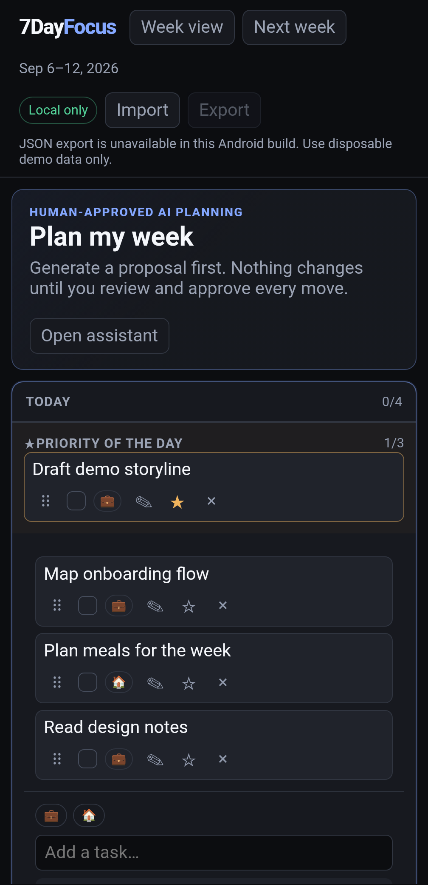
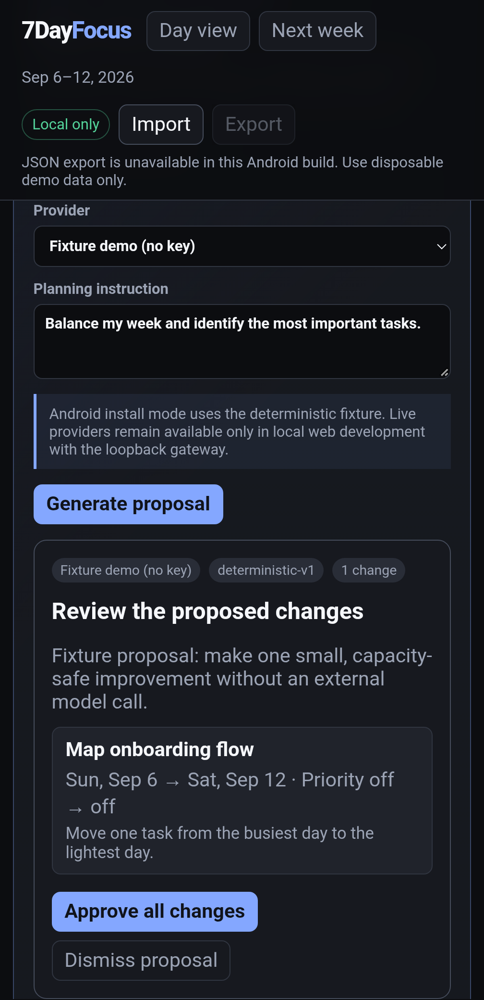
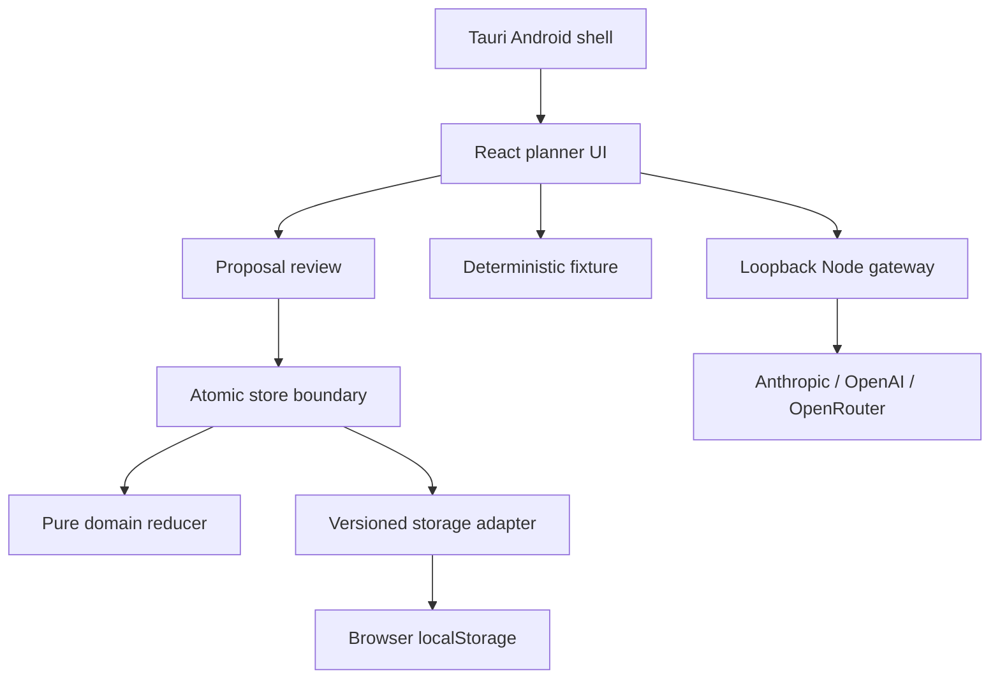

# 7DayFocus AI Delivery Lab

[Built by Andreas Nissen](https://github.com/Andreasniss) · [AndreasNissen.dev](https://andreasnissen.dev) · [Connect on LinkedIn](https://www.linkedin.com/in/andreasnissen) · [Source on GitHub](https://github.com/Andreasniss/7dayfocus-ai-delivery-lab) · [Apache-2.0](LICENSE)

A local-first seven-day planner for web and Android. Organize Work and Life tasks, set daily priorities, and review proposed planning changes before approving them. Try the populated fictional demo without an account or API key.


> **Portfolio status:** Completed learning lab and public pre-1.0 reference project. P02 hardened the domain and persistence boundary, P04 added the provider-flexible Plan My Week workflow, P05 completed publication review, and P11 reached installation and testing on a Pixel 8 Pro. This is an independent reference project, not a production service or a claim of provider affiliation, adoption, reliability, or scale.

> **Evidence snapshot, 6 September 2026:** 253 automated tests, including 24 deterministic proposal cases; one passing native Android regression test; zero known runtime npm vulnerabilities. The API 36 ARM64 debug build was installed and tested on a Pixel 8 Pro running Android 17. [P11 evidence](docs/ai-dlc/changes/P11-android-personal-install/evidence.md) records exact revisions, failures, fixes, and limitations. See the [case study](https://andreasnissen.dev/projects/7dayfocus-ai-delivery-lab/) for the product and engineering story.

## See the app

The weekly board makes the distribution of tasks visible. Switch to Day view for today's priorities and upcoming work. These genuine app captures use the same [15-task fictional demo week](examples/demo-week.json), not personal data or generated UI mockups.

<p>
  
  
</p>

Pixel 8 Pro, Android 17, app-only captures. The fixture proposes one capacity-safe move; nothing changes until approval. [Capture provenance and reproduction](docs/screenshots/README.md).

## What makes this implementation worth inspecting

- **A bounded week:** day and week views, Work/Life labels, priorities, completion, touch dragging, and a review-and-carry-over flow with daily capacity limits.
- **Suggestions stay outside saved state:** the assistant can propose moves and priorities for existing incomplete tasks, not create, rewrite, delete, or complete them.
- **Approval is enforced in code:** validate the whole proposed result, show a complete diff, reject stale proposals, then apply one atomic action only after explicit approval.
- **A reproducible offline path:** the fixture needs no credentials or model request. Android exposes only that path; optional live providers remain in local web development.
- **Inspectable data and delivery boundaries:** versioned storage, validated JSON import, non-destructive recovery, accepted change packets, deterministic tests, and retained real-device findings.

These are the project's distinguishing design choices, not a claim of market-wide feature uniqueness. Browser state stays local to that browser profile; Android state stays in its WebView. There are no accounts, cloud synchronization, or analytics.

## Run the fictional demo

Prerequisites: Git, npm, and Node.js 24.19.0 as selected by `.nvmrc`. With nvm installed:

```bash
git clone https://github.com/Andreasniss/7dayfocus-ai-delivery-lab.git
cd 7dayfocus-ai-delivery-lab
nvm use
npm ci
npm run verify
npm run dev
```

Open the Vite URL, choose **Import**, and select [`examples/demo-week.json`](examples/demo-week.json). Confirm replacement only if the current local data is disposable or backed up. Open **Plan my week**, keep **Fixture demo**, and generate a proposal. The initial demo proposes moving **Map onboarding flow** from Sunday to Saturday. Review the diff and select **Approve all changes**. Expected result: no task changes during generation; one validated move is applied only after approval. [Full walkthrough](examples/README.md).

Fixture mode needs no provider account or API key and makes no external request. Live mode requires the local gateway started by `npm run dev`, a user-owned provider key, and non-sensitive fictional planner data.

## Android personal-install path

P11 adds a minimal Tauri v2 shell around the current React application. The packaged Android UI exposes only the deterministic fixture because the loopback Node gateway used by live providers is not part of the Android package. This avoids pretending that API-key handling or live model calls have a safe mobile implementation.

The [PC runbook](docs/ANDROID.md) now has observed build and physical-phone evidence. Pixel testing caught and corrected status-bar overlap, narrow task text, and interrupted touch dragging. Android JSON import was verified; export is disabled with a visible warning because its WebView download path did not produce a file. Use disposable demo data. There is no dedicated in-app reset button; reimporting the demo restores its starting state after confirmation. Google Play and release signing remain optional and unclaimed, with any Play attempt capped at three focused hours.

## The Anthropic method this repository demonstrates

Anthropic's [AI-native SDLC playbook](https://claude.com/blog/the-ai-native-sdlc-playbook) keeps the familiar Plan, Design, Build, Test, Deploy, and Maintain responsibilities, then changes how work moves between them. Each stage produces a committed artifact that the next stage can read: `intent.md`, `spec.md`, `plan.md`, the code diff and tests, pull-request findings, and an incident record that can start the loop again. Humans correct and accept the artifacts that require product, architecture, risk, or release judgment.

This repository makes that handoff visible without claiming to reproduce Anthropic's internal process:

| Handoff | Repository evidence | Human gate |
| --- | --- | --- |
| Problem to design | [`intent.md`](docs/ai-dlc/changes/P04-plan-my-week/intent.md) becomes [`spec.md`](docs/ai-dlc/changes/P04-plan-my-week/spec.md) | Andreas accepts the outcome, constraints, and user-visible contract |
| Design to implementation | [`plan.md`](docs/ai-dlc/changes/P04-plan-my-week/plan.md) names the sequence and verification | Andreas accepts the implementation boundary before code changes |
| Implementation to review | Code, tests, evals, ADRs, and [`evidence.md`](docs/ai-dlc/changes/P04-plan-my-week/evidence.md) form the reviewable candidate | The pull request records findings, fixes, and merge approval |
| Learning to next change | Escaped defects and new requirements become a new issue and artifact packet | A human decides whether the evidence justifies another change |

The project adapts the pattern with provider-neutral `AGENTS.md`, `REVIEW.md`, severity levels, per-change folders, and a concise evidence ledger. Those are project conventions, not requirements stated by Anthropic. The [lifecycle guide](docs/ai-dlc/README.md) separates source guidance from local choices and records the P02 transition exception honestly.

## Related: the more comprehensive AWS AI-DLC method

AWS's [AI-Driven Development Life Cycle](https://aws.amazon.com/blogs/devops/ai-driven-development-life-cycle/) and the open-source [AI-DLC Workflows](https://awslabs.github.io/aidlc-workflows/guide/00-introduction/) go further as an enterprise delivery framework. They organize work across Inception, Construction, and Operations, use Units and Bolts to decompose and sequence implementation, calibrate workflow depth to scope and risk, and maintain explicit state, audit, and evidence across a larger lifecycle.

The two methods solve related problems at different levels. Anthropic offers a lightweight, committed-artifact handshake that is easy to inspect in one repository. AWS offers a broader governance and orchestration model for complex delivery. This lab intentionally implements the smaller Anthropic-inspired chain and links the AWS method as the next step when a project needs deeper decomposition, traceability, or enterprise controls. The companion article, [AI-Native Software Delivery: Which Method Fits Your Change?](https://andreasnissen.dev/writing/ai-native-software-delivery-methods/), also places OpenAI's harness-engineering approach beside both.

## What this demonstrates

| Capability | Inspectable evidence |
| --- | --- |
| Hands-on TypeScript/React engineering | Local planner UI, state boundary, import/export, and browser persistence |
| Domain correctness | Pure deterministic reducer with task, week, capacity, priority, move, and rollover invariants |
| Reliability and recovery | Versioned storage, bounded P01 migration, strict portable v2, non-destructive corrupt-data handling |
| Evaluation discipline | 253 automated tests across success, boundary, malformed-input, recovery, capacity, accessibility, mobile-runtime, provider-adapter, proposal-evaluation, and public-demo behavior |
| Applied model integration | Anthropic Messages, OpenAI Responses, and OpenRouter Chat Completions behind one proposal contract |
| Human control | Structured proposal, independent invariant validation, complete diff, stale-state check, explicit approval, atomic application |
| AI-assisted delivery | Accepted intent/specification/plan, ADRs, evidence ledger, severity-based review, and retained findings |
| Security judgment | Ephemeral BYOK handling, loopback gateway, fixed provider destinations, synthetic-data rule, and explicit residual limits |

## Architecture



UUID and date creation occur outside the reducer. Stored, imported, and model-generated JSON is treated as untrusted input. Invalid or stale proposals are rejected atomically. Fixture mode makes no provider request; live mode sends one bounded request through a loopback-only gateway to the selected fixed provider origin.

In the packaged Android runtime, the provider selector is restricted to fixture mode before a request can be formed. The Android shell does not contain the Node gateway.

## Guided reviewer path

1. Read [`docs/ai-dlc/README.md`](docs/ai-dlc/README.md) for the lifecycle and source boundary.
2. Open the [`P04 intent, specification, plan, and evidence`](docs/ai-dlc/changes/P04-plan-my-week/) for the accepted applied-AI contract.
3. Inspect [`src/domain/planProposal.ts`](src/domain/planProposal.ts), [`server/providers.mjs`](server/providers.mjs), and the [24 deterministic eval cases](evals/README.md).
4. Read [`ADR 0004`](docs/adr/0004-local-byok-proposal-gateway.md) and the [`threat model`](docs/THREAT-MODEL.md).
5. Inspect [`docs/ai-dlc/changes/P02-domain-hardening/`](docs/ai-dlc/changes/P02-domain-hardening/) and [`ADR 0002`](docs/adr/0002-domain-and-persistence-invariants.md) for the underlying planner invariants.
6. Review the [`P05 publication record`](docs/ai-dlc/changes/P05-publication/), [`SECURITY.md`](SECURITY.md), [`PROVENANCE.md`](PROVENANCE.md), and [`REVIEW.md`](REVIEW.md) for release evidence, limits, ownership, and review gates.
7. Review the [`P11 Android packet`](docs/ai-dlc/changes/P11-android-personal-install/), [`ADR 0005`](docs/adr/0005-tauri-fixture-only-android-shell.md), and the [device runbook](docs/ANDROID.md) for the fixture-only mobile boundary, observed phone results, and remaining limits.

## What changed after the prototype

The original product need was real: I wanted a focused seven-day planner and a concrete way to learn cross-platform development, AI-assisted delivery, model integration, evaluations, and human approval. An earlier private React and Tauri v2 proof of concept reached Android Studio and emulator testing and was prepared for distribution, but it was never launched as a production app.

The surrounding platform then improved faster than the standalone product. In my current personal workflow, Claude and ChatGPT provide the context-rich orchestration layer. Todoist provides the task system of record and visual interface through its connector and CLI. That combination is more useful than a separate AI planner because the orchestrator can reason across broader context while Todoist already handles durable task storage and everyday interaction.

Stopping standalone-product development is therefore a product-discovery result, not an incomplete launch disguised as success. The repository remains valuable as an inspectable learning lab for the Anthropic-inspired artifact chain, bounded model proposals, deterministic evaluation, threat modeling, and explicit human control.

## Roadmap and optional backlog

The versioned [`ROADMAP.md`](ROADMAP.md) and open [GitHub issues](https://github.com/Andreasniss/7dayfocus-ai-delivery-lab/issues) record possible learning and portfolio extensions, not a commitment to revive the standalone product. P11 preserves one personally meaningful goal: install and test the Android build on Andreas's phone. Any Google Play attempt is optional and capped at three hours. P07–P10 proceed only when they add specific learning or inspectable evidence.

## Current product boundary

The planner supports creating, editing, completing, prioritizing, labeling, moving, deleting, reviewing, carrying over, importing, and exporting tasks. State is stored as plaintext JSON in the current browser profile.

The project deliberately excludes:

- model-driven task creation, rewriting, deletion, completion, automatic application, or background execution;
- authentication, accounts, multi-user operation, hosted credential storage, or a remotely accessible gateway;
- telemetry, analytics, cloud application deployment, or production persistence;
- live-provider access from the packaged Android application;
- customer, employer, health, financial, or other sensitive data; and
- claims of production readiness, security certification, accessibility conformance, adoption, reliability, or scale.

Use only non-sensitive synthetic or fictional planner data. Live requests are subject to the selected provider's policies and billing. Concurrent tabs remain last-write-wins. Live-provider behavior, rendered visual QA, and hosted CI are claimed only when their results are explicitly recorded in current evidence.

## Bring your own provider key

| Provider | Default model | API shape | Credential behavior |
| --- | --- | --- | --- |
| Anthropic | `claude-sonnet-5` | Messages API with native structured outputs | Cleared from the UI after the request |
| OpenAI | `gpt-5.6-luna` | Responses API with `store: false` and structured outputs | Cleared from the UI after the request |
| OpenRouter | `openrouter/free` | Chat Completions with structured outputs and required-parameter routing | Cleared from the UI after the request |

Model IDs are editable because availability changes. The provider cannot change the endpoint: the gateway maps the selected provider to one fixed HTTPS origin. API keys are not stored, exported, logged, or committed. Browser extensions and local-machine compromise remain outside this reference project's protection boundary.

## AI-assisted delivery disclosure

Andreas owns product intent, architecture, requirements, evaluation criteria, risk acceptance, and release decisions, and reviews merged work. Claude Code assisted the predecessor project. OpenAI Codex assisted the clean-room extraction, P02 and P04 implementation, tests, documentation, and verification. AI output is treated as proposed work, not as independent human review or evidence of correctness.

The lifecycle is derived from selected public Anthropic material and adapted with provider-neutral project conventions. It is not an Anthropic standard, certification, approval, endorsement, or compliance claim. No raw prompts, private reasoning, customer material, or employer-confidential data are included.

## FAQ

### Do I need an API key to try the planner?

No. Import the fictional demo week and use **Fixture demo**. It exercises generation, review, and approval without a model request. Optional live providers require your own key and the local web gateway; deterministic tests do not establish live-model quality.

### Does Android support live providers and JSON export?

No. The packaged app is fixture-only. JSON import was verified on the recorded Pixel installation; export is disabled because the tested WebView download path did not produce a file. See the [Android runbook](docs/ANDROID.md) for prerequisites and observed limits.

### Should I use Plan mode or automatic execution when changing this repository?

Use Plan mode when you want to settle requirements or design before implementation. For clear, authorized work, an execution-enabled mode can also plan and follow the bundled delivery skill. Preserve this repository’s required acceptance of intent, specification, and plan before implementation. Host permissions still govern actions; a skill or generated plan does not grant approval. [Choosing a delivery method](https://andreasnissen.dev/writing/ai-native-software-delivery-methods/) explains the distinction.

### Where do the delivery records and planner data live?

Accepted change records and evidence are committed under [`docs/ai-dlc/changes/`](docs/ai-dlc/changes/), with current review status in GitHub issues and pull requests. Planner data is separate plaintext browser or WebView storage. Native assistant plans are not assumed to disappear at session end, but their retention is host-specific; commit the useful decisions and evidence required for this repository’s durable record. Never commit raw conversations or private data.

## Related writing

| Read | Why it matters here |
| --- | --- |
| [7DayFocus case study](https://andreasnissen.dev/projects/7dayfocus-ai-delivery-lab/) | Product outcome, app screenshots, and observed device findings |
| [AI-Native Software Delivery: Which Method Fits Your Change?](https://andreasnissen.dev/writing/ai-native-software-delivery-methods/) | How this lightweight artifact approach fits alongside other methods |
| [AGENTS.md and CLAUDE.md: Shared Rules, Different Entry Points](https://andreasnissen.dev/writing/agents-md-claude-md-shared-instructions/) | Shared repository rules across assistant entry points |
| [What Evidence Should an AI-Generated Pull Request Carry?](https://andreasnissen.dev/writing/evidence-for-ai-generated-pull-requests/) | What reviewers should be able to inspect |

Follow the [AI-Assisted Software Delivery series](https://andreasnissen.dev/series/ai-assisted-software-delivery/) for the reading order.

## Delivery workflow

This repository uses [AI SDLC Skill](skills/ai-sdlc-skill/README.md), an independently written adaptation of selected [Anthropic AI-native SDLC guidance](https://claude.com/blog/the-ai-native-sdlc-playbook). It preserves repository instructions and separates planning, verification evidence, review, and release authority. It is an experimental delivery aid, not a security boundary or evidence of measured productivity gains. See the [adoption guide](skills/ai-sdlc-skill/references/adoption.md) and [pilot record](docs/evidence-sdlc-pilot.md).

The bundled copy is pinned to the reviewed [standalone source](https://github.com/Andreasniss/ai-sdlc-skill/tree/811c549bf772cfac6ad285faf374ca32a7e820d1). The [source manifest](skills/ai-sdlc-skill.source.json) records the exact commit and each file digest. Updates require a reviewed PR; the repository never downloads skill updates automatically.

## Contributing and reuse

Read [CONTRIBUTING.md](CONTRIBUTING.md) for setup, verification, and contribution expectations, [SECURITY.md](SECURITY.md) for reporting guidance, and [PRIVACY.md](PRIVACY.md) before any public upload. Install the local hooks as documented there. Keep private authoring outside public branches and PRs; intentional demo prompts, synthetic fixtures, and reviewed engineering evidence remain public.

Copyright 2026 Andreas Nissen. Original project code and accompanying technical documentation are licensed under [Apache-2.0](LICENSE), except where separately indicated. See [NOTICE](NOTICE). Third-party dependencies and bundled material retain their own terms.

This independent personal project is not affiliated with or endorsed by any provider or employer. Third-party names and marks belong to their respective owners.
